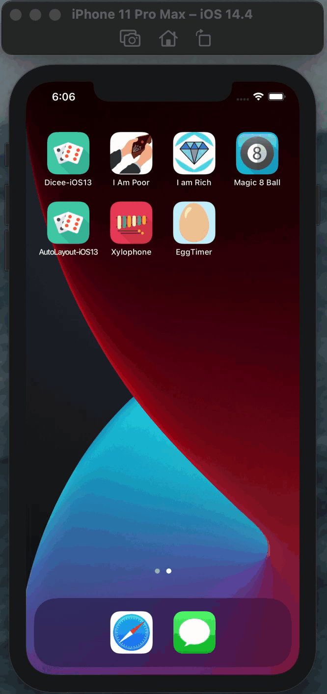

<h2>☑️ What is this app about?</h2>

A beautiful egg timer app to boil your eggs to perfection depending on how you prefer your eggs.

<h2>☑️ What have I learned?</h2>
<ul>
  <li>Swift Collection types - Dictionaries.</li>
  <li>The Swift Timer API.</li>
  <li>Conditional statements - IF/ELSE. </li>
  <li>Conditional statements - Switch.</li>
  <li>SFunctions with outputs.</li>
  <li>How to use the ProgressView.</li>
</ul>
<h2>☑️ Final look of Egg Timer app🍳</h2>

